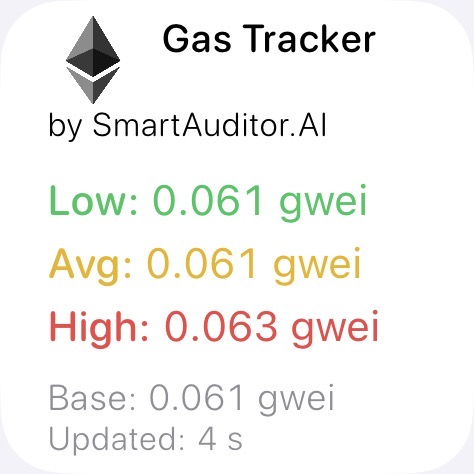

# Ethereum Gas Tracker Widget for iOS 📱

A collection of beautiful and functional iOS widgets for cryptocurrency enthusiasts, built with [Scriptable](https://scriptable.app/).

## Ethereum Gas Tracker Widget
Current Ethereum network gas prices at a glance, powered by [Etherscan API](https://etherscan.io/gastracker).

**Features:**
- Low, Average, and High gas prices in Gwei
- Base fee display
- Color-coded for easy reading (Green/Yellow/Red)
- Last update timestamp
- Tap to open Etherscan Gas Tracker

## 💡 Benefits

- **Stay Informed**: Monitor crypto sentiment and gas prices directly from your iPhone home screen
- **Save Money**: Check gas prices before making transactions to avoid overpaying
- **No Apps Needed**: Lightweight widgets that don't require bulky apps
- **Privacy First**: No data collection, direct API calls only
- **Beautiful Design**: Clean, modern UI that matches iOS aesthetics
- **Auto-Updates**: Widgets refresh automatically based on Scriptable's schedule
- **Free & Open Source**: No subscriptions, no hidden fees

## 🚀 Installation

1. **Install Scriptable** from the [App Store](https://apps.apple.com/us/app/scriptable/id1405459188) (free)
2. **Download the scripts** from this repository
3. **Open Scriptable** and tap the + icon to create a new script
4. **Copy & paste** the script content
5. **Add widget to home screen**:
   - Long press on home screen → tap + → search "Scriptable"
   - Choose Small widget size
   - Tap widget → select the script name
   - Done! 🎉

## 📋 Requirements

- iOS 14 or later
- Scriptable app (free)
- Internet connection for data fetching

### 📸 Screenshots

### 🤝 Contributing

Contributions are welcome! Feel free to:
- Report bugs
- Suggest new features
- Submit pull requests
- Create new widget scripts

### 📝 License

MIT License - feel free to use and modify as you wish!

### ⭐ Support

If you find these widgets useful, please consider:
- Giving this repo a star ⭐
- Sharing with fellow crypto enthusiasts
- Contributing new widgets

---

**Made with ❤️ by SmartAuditor.AI**

*Disclaimer: These widgets are for informational purposes only. Not financial advice.*
